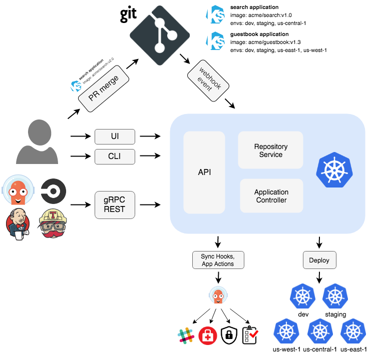

<!--
_paginate: false
_footer: ""
-->
<style scoped>
h1,h2 {
  text-align: center;
}
h1 {
  color: black;
  text-decoration: underline;
  font-size: 3em;
}
h2 {
  color: black;
  font-size: 2em;
}
img {
    vertical-align: middle;
}
</style>

# Kubernetes & Argo-CD
## _Higher-Order Operational Solutions_
## Carson Anderson - Weave
##  carsonoid &nbsp;&nbsp;&nbsp;&nbsp;&nbsp;  carson_ops

---

# About Me


* Running Kubernetes in production since v1.0
* Automated cluster creation on multiple clouds
* Designed K8s clusters that handled ~2 Million pods per day
* Ran complex systems on Kubernetes at 3 different companies

---

# Running Software on Raw Kubernetes Sucks

---

# Using Kubernetes as a Platform is Great!

- The primitives are robust:
  - Effecient scheduling
  - Internal and external load balancing is easy
  - Setup and tear-down procedures
  - Sidecars
- The APIs are fantastic:
  - Resource watches make things fast
- The extensibility is... extensive
  - Operators
  - CRDs
  - Validating/Mutating Webhook

---

# So why is the overall experience so rough?

* Many low-level tools
* Most of the tools
  - Are general purpose
  - Are not opinionated
  - Don't think past resource generation

---

# K8s is Infrastructure as Code

```yaml
apiVersion: apps/v1
kind: Deployment
metadata:
  name: guestbook-ui
spec:
  replicas: 1
  revisionHistoryLimit: 3
  selector:
    matchLabels:
      app: guestbook-ui
  template:
    metadata:
      labels:
        app: guestbook-ui
    spec:
      containers:
      - image: gcr.io/heptio-images/ks-guestbook-demo:0.2
        name: guestbook-ui
        ports:
        - containerPort: 80
```

---

# Plan A: Resource Declaration or Generation

A lot of ways to describe your system, but not very prescriptive on how to
updated it, track changes, or view the status

- Raw YAML
- Kustomize
- Jsonnet
- And more!

---

# Raw YAML

- We all start here
- Do all management with local files and tools

```sh
$ vim guestbook/deployment.yaml
$ vim guestbook/service.yaml
$ kubectl apply -f guestbook/

$ kubectl edit deployment/guestbook

$ kubectl patch deployment/guestbook -patch "$(cat patch-file.json)"

$ kubectl delete -f guestbook/
```

---

# Kustomize

- Semi-blessed
- Built in to `kubectl` since v1.14.0
- Build a `base` and apply `overlay` configs

```sh
kustomize-guestbook/
├── guestbook-ui-deployment.yaml
├── guestbook-ui-svc.yaml
├── kustomization.yaml
├── dev
│   ├── guestbook-ui-deployment.yaml
│   └── kustomization.yaml
└── prod
    ├── guestbook-ui-deployment.yaml
    └── kustomization.yaml
```

---

# Jsonnet

- Supports some deduplication
- Has some type support
- Lots of K8s-based forks/extensions
- Can render to regular `json`

---

# Jsonnet Example

```
local params = import 'params.libsonnet';

[
   {
      "apiVersion": "v1",
      "kind": "Service",
      "metadata": {
         "name": params.name
      },
      "spec": {
         "ports": utils.portList(params),
         "selector": {
            "app": params.name
         },
         "type": params.type
      }
   },
]
```

---


# Plan A Tools: `<Document Generation> + kubectl`

### Raw YAML

```sh
$ vim guestbook/deployment.yaml
$ vim guestbook/service.yaml
$ kubectl apply -f guestbook/
```

### Kustomize

```sh
$ kubectl apply -k kustomize-guesttbook/dev/
```

### Jsonnet

```sh
$ jsonnet -y jsonnet-guestbook/guestbook-ui.jsonnet | kubectl apply -f -
```

---

# Plan A Reporting: `kubectl get`

```i
$ kubectl get -f guestbook/
$ kubectl get -k kustomize-guestbook/
$ jsonnet -y jsonnet-guestbook/guestbook-ui.jsonnet | kubectl get -f -
```

```
NAME                           READY   UP-TO-DATE   AVAILABLE   AGE
deployment.apps/guestbook-ui   1/1     1            1           5s

NAME                   TYPE        CLUSTER-IP     EXTERNAL-IP   PORT(S)   AGE
service/guestbook-ui   ClusterIP   10.43.165.59   <none>        80/TCP    5s
```

<!--  Where are the pods? Where are the Endpoints? -->

---

# Plan A Administration

- `kubectl create`
- `kubectl apply`
- `kubectl edit`
- `kubectl patch`
- `kubectl delete`

---


---


# Plan B: Helm

* Tiller 😡
* Templated YAML
* Upgrades via overwrite
* "History" stored via big blobs in secrets

---

# Helm: Templated Yaml

```yaml
apiVersion: apps/v1
kind: Deployment
metadata:
  name: {{ template "helm-guestbook.fullname" . }}
  labels:
    app: {{ template "helm-guestbook.name" . }}
    chart: {{ template "helm-guestbook.chart" . }}
    release: {{ .Release.Name }}
    heritage: {{ .Release.Service }}
spec:
  template:
    spec:
      containers:
        - name: {{ .Chart.Name }}
          image: "{{ .Values.image.repository }}:{{ .Values.image.tag }}"
          resources:
{{ toYaml .Values.resources | indent 12 }}
    {{- with .Values.nodeSelector }}
      nodeSelector:
{{ toYaml . | indent 8 }}
    {{- end }}
    {{- with .Values.affinity }}
      affinity:
{{ toYaml . | indent 8 }}
    {{- end }}
    {{- with .Values.tolerations }}
      tolerations:
{{ toYaml . | indent 8 }}
    {{- end }}
```

---

# Helm: Resource Generation

```
$ helm template helm-guestbook/.
---
# Source: helm-guestbook/templates/service.yaml
apiVersion: v1
kind: Service
metadata:
  name: release-name-helm-guestbook
  labels:
    app: helm-guestbook
    chart: helm-guestbook-0.1.0
    release: release-name
    heritage: Tiller
spec:
 ...

---
# Source: helm-guestbook/templates/deployment.yaml
apiVersion: apps/v1
kind: Deployment
metadata:
  name: release-name-helm-guestbook
  labels:
    app: helm-guestbook
```

---

# Plan B: `helm install`, `helm upgrade`

```sh
$ helm install -n guestbook helm-guestbook/
```

```sh
$ helm upgrade guestbook helm-guestbook/
```

---

# Plan B Reporting: `helm list`, `helm status`

```sh
$ helm list
NAME        REVISION	UPDATED                 	STATUS  	...
guestbook   1       	Mon Feb 10 21:22:58 2020	DEPLOYED	...
guestbook-2 1       	Mon Feb 10 21:22:58 2020	DEPLOYED	...

$ helm status guestbook
LAST DEPLOYED: Mon Feb 10 21:22:58 2020
NAMESPACE: default
STATUS: DEPLOYED

RESOURCES:
==> v1/Deployment
NAME                      AGE
guestbook-helm-guestbook  51m

==> v1/Pod(related)
NAME                                       AGE
guestbook-helm-guestbook-8647599cdc-58z9j  51m

==> v1/Service

NAME                      AGE
guestbook-helm-guestbook  51m
```

---

# What about Visualization?

* See deployed resources
* Visualize relationships between them
* Watch for changes
* Access control?

---
 <iframe width="100%" height="100%" frameborder="0" src="./diagrams/k8s-and-argo-example.sozi.html">
</iframe>

---
<style scoped>
h1 {
  text-align: center;
  color: black;
  text-decoration: underline;
  font-size: 2.5em;
  vertical-align: top;
  text-shadow: 0 0 20px white,
 0 0 20px white, 0 0 20px white, 0 0 20px white;
  background: #FFFFFFCC;
}

</style>

# The Kubernetes Dashboard 😧


---

# Argo-CD


* GitOPs based
* Provides helpful abstractions
  - Project
  - Application
* Manages YAML from multiple sources
  - YAML
  - Helm
  - Kustomize
  - Jsonnet

---

# Organizational Features


* SSO via Dex
  - GitHub
  - SAML
  - Oauth
  - etc...
* Robust RBAC
  - Project-based access
  - Group-based access

---



---

# Argo-CD Custom Resource: Application

Represents a group of related resources

```yaml
apiVersion: argoproj.io/v1alpha1
kind: Application
metadata:
  name: helm-guestbook
  destination:
    namespace: helm-guestbook
    server: https://kubernetes.default.svc
  project: default
  source:
    helm:
      valueFiles:
      - values-production.yaml
      values: 'replicaCount: 2'
    path: helm-guestbook
    repoURL: https://github.com/argoproj/argocd-example-apps
    targetRevision: HEAD
```

---

# Argo-CD Custom Resource: AppProject

Represents access controls for users and Applications

```yaml
apiVersion: argoproj.io/v1alpha1
kind: AppProject
metadata:
  name: lockdown
spec:
  clusterResourceWhitelist: []
  namespaceResourceBlacklist:
  - group: 'cert-manager.io'
    kind: '*'
  destinations:
  - namespace: 'lockdown'
    server: '*'
  sourceRepos:
  - '*'
```

---


# Argo-CD Live Demo

---
<!--
_paginate: false
_footer: ""
-->

<style scoped>
h1,h2,h3 {
  text-align: center;
}
h1 {
  color: black;
  text-decoration: underline;
  font-size: 3em;
}
h2 {
  color: black;
  font-size: 2em;
}
h3 {
  color: black;
  font-size: 1.5em;
}
</style>

# Questions?
## Carson Anderson - Weave
##  carsonoid &nbsp;&nbsp;&nbsp;&nbsp;&nbsp;  carson_ops
## Markdown To Slides: https://marp.app
### https://github.com/carsonoid/talk-k8s-and-argo
